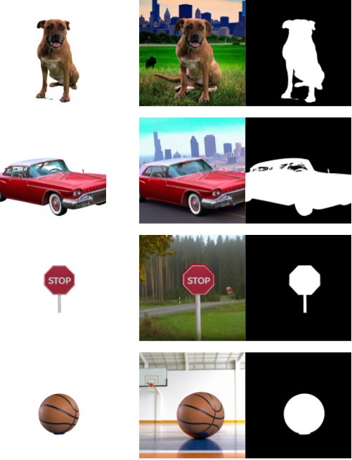

# Generating Image Segmentation Training Data with the OpenAI API

## Overview

Segmentation models require large amounts of labeled training data, and data is often difficult and time-consuming to acquire. This pipeline addresses the issue by utilizing the OpenAI API to generate synthetic training data that is both diverse and realistic. By leveraging state-of-the-art generative models, the pipeline is able to create large amounts of high-quality training data in a fraction of the time and cost it would take to manually label real-world images. 

### Method

This method uses the `openai.Completion.create()`, `openai.Image.create()`, and `Image.create_edit()` methods from the OpenAI API and consists of three steps:

1. Given a subject provided by the user (e.g., "dog", "coffee cup"), the pipeline first calls `openai.Image.create()` to generate an image of the subject on a "greenscreen"-like background. 

2. Using image thresholding with OpenCV, the subject is segmented from the background and a segmentation mask for the image is generated. The original image has the alpha channel added to match the segmentation mask.

3. "Ideas" for backgrounds for the new training data are created by calling the `openai.Completion.create()` method. The prompt passed with this function includes the subject of the image to help generate more realistic backgrounds. For each new image to be created, a background is randomly sampled from this list and then inserted into a prompt to be used in conjunction with `Image.create_edit()`.

The pipeline automatically creates two new directories within the current path, `"images"` and `"masks"`, unless alternative directories are provided when calling `generate_examples`. The generated images with backgrounds and the segementation masks will be stored in their respective directories. This allows the user to easily create datasets and dataloaders in frameworks like [PyTorch](https://pytorch.org/tutorials/beginner/data_loading_tutorial.html) after generating the images to easily train or fine-tune models. 

### Limitations

This pipeline works well for generating single-subject trainings images for segmentation projects, but is still somewhat limited in it's capabilities. First, it's not possible to generate any multi-class data, which can be limiting for some applications. Additionally, segmentation masks may not always map perfectly to the final output. Finally, there's always some performance gap between models trained on real-world data and those trained with simulation data, which is one last thing to keep in mind when using sim data of any kind.

## Demos

Some example outputs have been shown below:

A demo that will produce three example outputs can be easily run from the terminal by calling `demo.py`. The function assumes that the user has their API key stored in an environment variable `"OPENAI_API_KEY"`. 

Additionally, a Jupyter Notebook, `demo.pynb`, has been provided; this notebook allows the user to easily generate and visualize their own image data. 

## Requirements

To use this pipeline, you will need to have the following dependencies installed:

* numpy
* cv2
* urllib
* openai with an OpenAI API key

