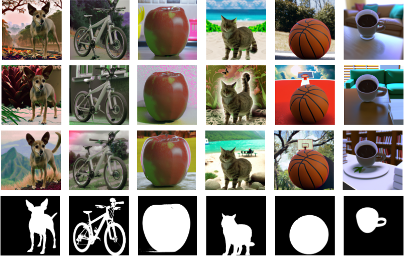
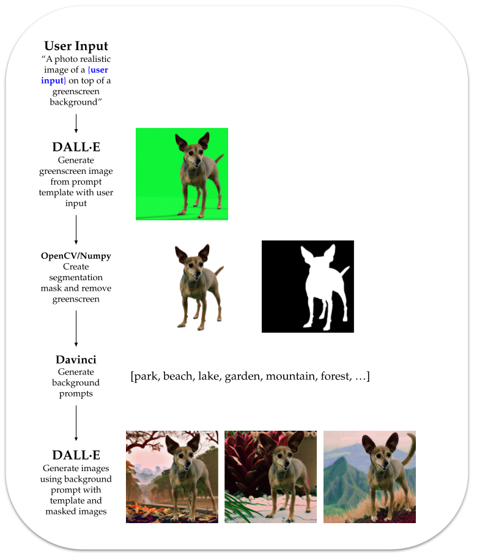

# Generating Image Segmentation Training Data with the OpenAI API

## Overview

Image segmentation is a challenging and important task in computer vision, with applications in medical imaging, robotics, autonomous driving, and scene understanding. Segmentation models require large amounts of labeled training data, and data is often difficult and time-consuming to acquire. This pipeline addresses the issue by utilizing the OpenAI API to generate synthetic training data that is both diverse and realistic. By leveraging state-of-the-art generative models, the pipeline is able to create large amounts of high-quality training data in a fraction of the time and cost it would take to manually label real-world images. 

Below several different images and their ground truth segmentation masks are shown, all of which have been generated using the pipeline in this project that exploits the OpenAI image generation, image editing, and text completion APIs.

## Applications

Segmentation data is expensive to generate from real-world imagery, and some subject matter is hard to capture in large volumes. Currently, there are some existing platforms to generate simulated imagery, but they can be expensive and often require dedicated software engineers to set up individual "scenarios." A pipeline like this that allows users to generate segmentation data has many potential applications in a variety of fields in computer vision. By utilizing generative models, users aren't heavily restricted in the subject matter they can generate training data for, and creating these datasets isn't restricted to users with a high degree of programming skill. 

The examples above show generated data for pets and common objects. However, with new prompts, this pipeline could be adapted for more niche applications like medical imaging. 

## Method  

This method uses the `openai.Completion.create()`, `openai.Image.create()`, and `Image.create_edit()` methods from the OpenAI API and consists of three steps:

**Step 1**: Given a subject provided by the user (e.g., "dog", "coffee cup"), the pipeline first calls `openai.Image.create()` to generate an image of the subject on a "greenscreen"-like background. The function uses a relatively simple prompt, "a photo realistic image of a {user input} on top of a greenscreen background", to generate the imagery; although simple, this prompt has produced consistent results that can easily be used to generate segmentation masks with thresholding.

**Step 2**: Using [image thresholding](https://en.wikipedia.org/wiki/Thresholding_(image_processing)) with [OpenCV](https://docs.opencv.org/4.x/d7/d4d/tutorial_py_thresholding.html), the subject is segmented from the greenscreen background and a segmentation mask for the image is generated. The segmentation mask is saved to the user-specified directory so it can later be used to create a dataset for training. The original image has a fourth channel (alpha channel) added to match the segmentation mask and add transparency. 

**Step 3**: "Ideas" for backgrounds for the new training data are created by calling the `openai.Completion.create()` method using the Davinci model. The prompt passed with this function includes the subject of the image to help generate more realistic backgrounds, "Describe some places to use as a background in an image of a {subject} as a comma delimited list:". The temperature for this model was set to 0.5 to help add some variety to the suggestions.

The comma delimited list returned by the model is parsed into a list. For each new image to be created, a background is randomly sampled from this list and then inserted into a very simple prompt to be used in conjunction with `Image.create_edit()`. More simple prompts were found to perform better than complex ones when using `Image.create_edit()`; the prompt used to generate training data is "a {subject} in front of a {background}", taking the user-input subject and randomly-selected background strings. 

The pipeline automatically creates two new directories within the current path, `"images"` and `"masks"`, unless alternative directories are provided when calling `generate_examples`. The generated images with backgrounds and the segementation masks will be stored in their respective directories. This allows the user to easily create datasets and dataloaders in frameworks like [PyTorch](https://pytorch.org/tutorials/beginner/data_loading_tutorial.html) after generating the images to easily train or fine-tune models. 

## Limitations

This pipeline works well for generating single-subject trainings images for segmentation projects, but is still somewhat limited in it's capabilities. First, it's not possible to generate any multi-class data, which can be limiting for some applications. Additionally, segmentation masks may not always map perfectly to the final output. Finally, there's always some performance gap between models trained on real-world data and those trained with simulation data, which is one last thing to keep in mind when using sim data of any kind.

## Demos

A demo that will produce three example outputs can be easily run from the terminal by calling `demo.py`. The function assumes that the user has their API key stored in an environment variable `"OPENAI_API_KEY"`. 

Additionally, a Jupyter Notebook, `demo.ipynb`, has been provided; this notebook allows the user to easily generate and visualize their own image data. 

## Requirements

To use this pipeline or play around with the demos, you will need to have the following dependencies installed:

* numpy
* cv2
* urllib
* openai with an OpenAI API key
